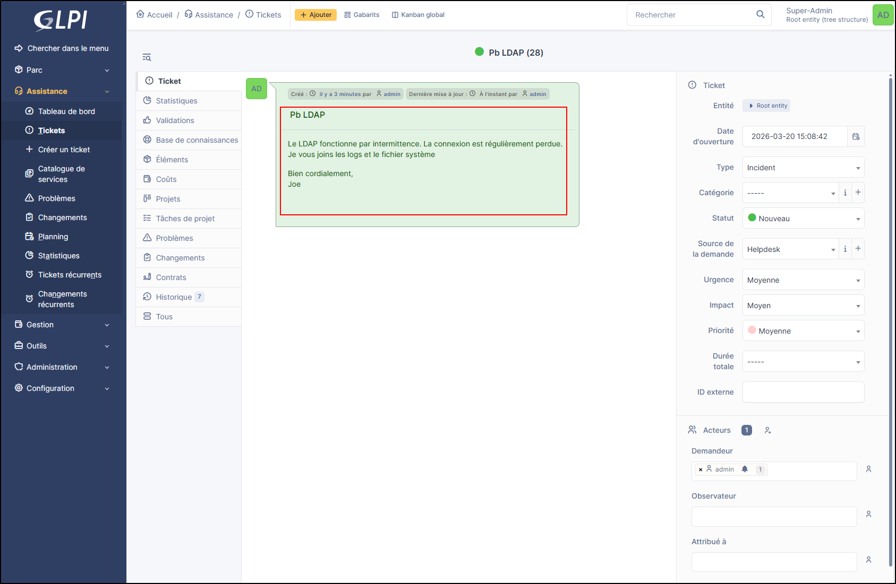

# :tabler-outline-forms: Savoir identifier les informations d'un ticket

Cette partie a pour but d'aider à l'identification des **informations importantes avant le traitement**.
Ces étapes sont essentielles pour gagner en autonomie, en rapidité de traitement et assure un bon suivi client.

## 1. ^^Les étapes^^

Ces premières étapes sont là pour savoir où situer les vérifications de base qui permettront un bon traitement du ticket.

- Lire la description et savoir identifier les informations pertinentes
- Déterminer : plugin ou cœur ?
- Identifier la version de GLPI ou du plugin

### ^^Identification du sujet^^

Les tickets peuvent traiter d'un ou plusieurs sujets en même temps complexifiant le ticket remonté par le client. Il est essentiel comprendre le cas remonté afin de pouvoir en identifier la raison.

* GLPI
* Plugin

Le ticket est classé comme : 

* Incident
* Demande

!!! Note
    Le ticket peut être reclassé si le type de demande n'est pas approprié au cas remonté.

### ^^Identification de l’émetteur^^

Selon l'émetteur, le traitement sera différent. Si le ticket provient d'un partenaire, un langage technique peut être plus approprié que pour un client final.

* Client
* Partenaire

Le type d'instance est également à prendre en compte.

* Cloud privé
* Cloud public
* Seflf-hosted

!!! Tip
    Grâce au `cloud-tools`, l'accès aux instances Cloud est grandement simplifié évitant la demande de transmission de logs. 

### ^^Vérification de l’interlocuteur^^

Il est impératif de vérifier que le demandeur soit bien le rédacteur du ticket. Si ce n'est pas le cas, un compte peut être créé sur demande afin de rendre les échanges plus fluides.

### ^^Cas particuliers^^

* Que faire si je ne parviens pas à identifier l’émetteur (tag manquant, section « private cloud » absente) ?
* Que faire si je ne parviens pas à déterminer s’il s’agit d’un plugin ou de GLPI ?
* Que faire si aucune version n’est indiquée ?
* Que faire si le demandeur est différent du rédacteur (gabarit de suivi / informer Pierre) ?

## 2. ^^Améliorations / Documentation à envisager^^

### ^^Amélioration des formulaires (Forms) pour garantir la complétude des données^^

* Éviter la saisie manuelle de la version de GLPI
* Éviter la saisie manuelle de la version du plugin
* Filtrer la liste des entités partenaires via des tags
* Permettre de renommer les fichiers téléversés (ex : logfile.txt, system.txt) afin de :
  * faciliter leur analyse automatique via un plugin
  * ou permettre un traitement basé sur la description du ticket

### ^^Évolution des formulaires^^

* Ajouter une étape initiale pour uploader le fichier « system »
* Structurer automatiquement les données dans des champs dédiés :
  * Plugin / version
  * GLPI / version
  * Version µH
  * OS
  * etc.

## Adapter la description du ticket généré depuis un formulaire

## Vérification du fichier « system » (stagiaire / dev)

### Objectif

Identifier les versions obsolètes et les informations techniques pertinentes

## Pistes

* Lecture du fichier « system » via un plugin
* Actions possibles :
  * Ajouter un suivi privé pour inciter à la mise à jour
  * Vérifier les versions (GLPI / plugins)
  * Vérifier les informations système (OS, PHP, etc.)
  * Gérer le consentement utilisateur (point important)

## Plugin « Teclib Inventory Connector » (Administration)

* Comment afficher à la section « GLPI Cloud » ?
* Que faire sur [inventory.teclib.com](http://inventory.teclib.com) ?
* Où trouver / installer le plugin ?

## Tag des entités (Administration)

* Comment ajouter un tag ?
* À partir de quelles informations ?
